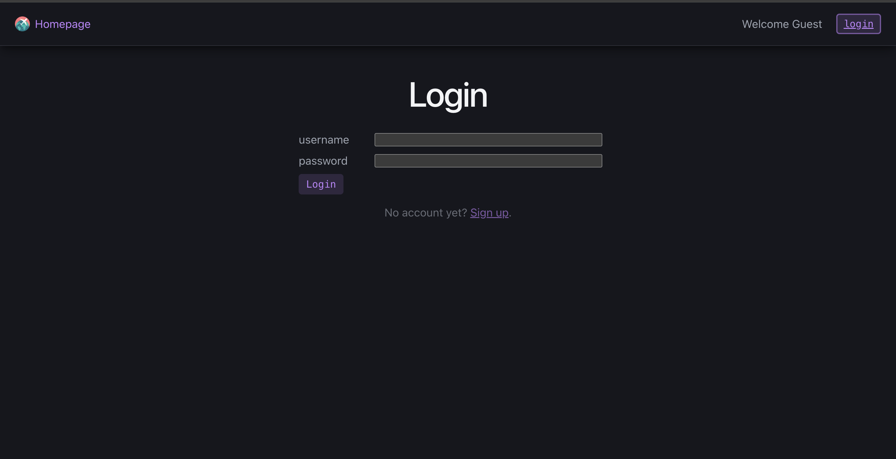
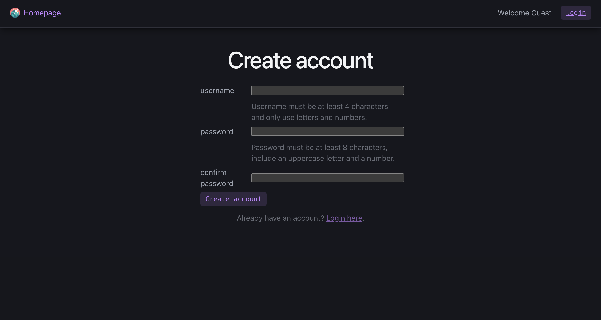
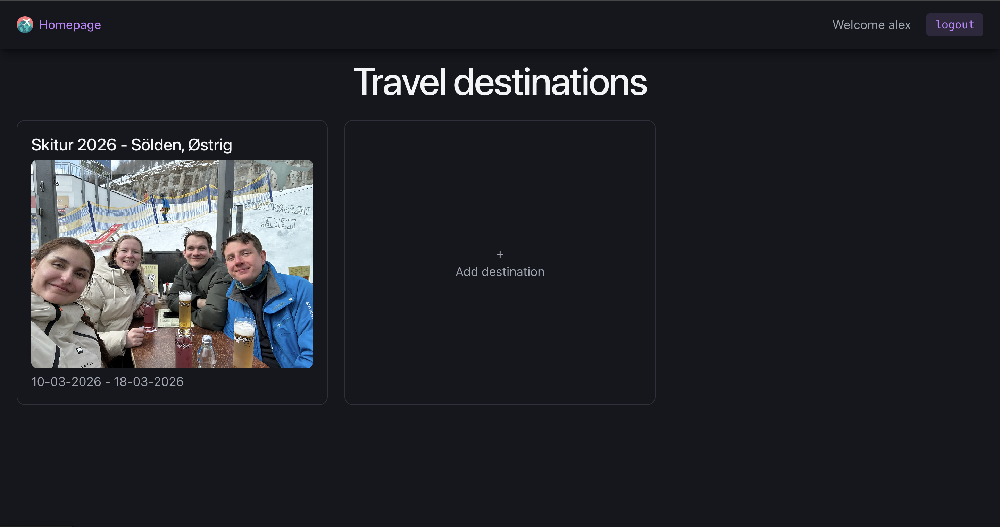
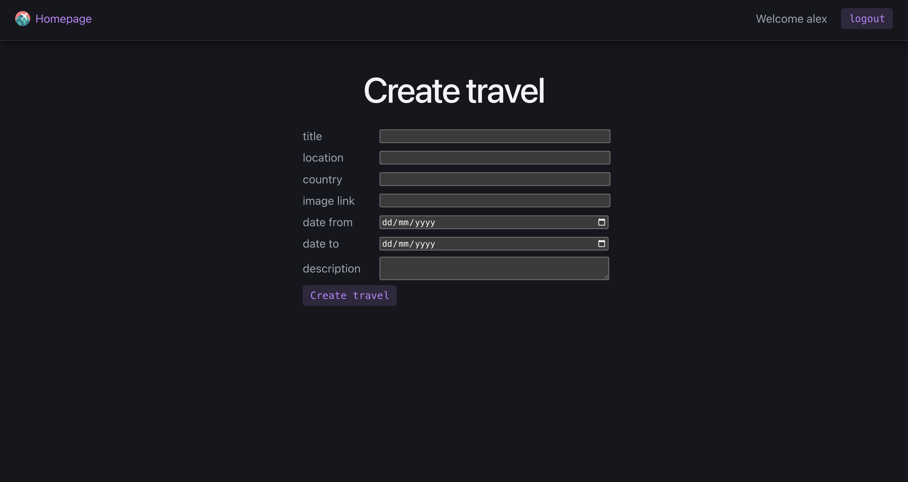
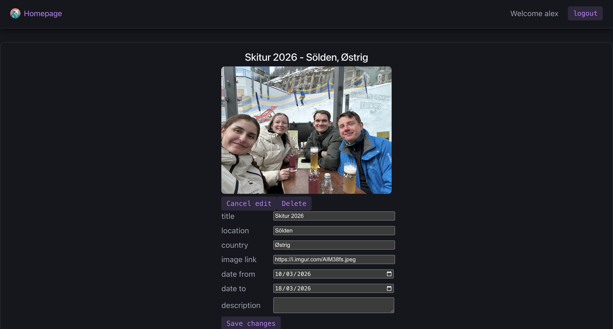

# Travel Destinations

## Screenshots

| Login                 | Create account                 |
| --------------------- | ------------------------------ |
|  |  |

| Homepage               |
| ---------------------- |
|  |

| Create destination                 | Edit destination                 |
| ---------------------------------- | -------------------------------- |
|  |  |

## Task description

### Backend

We expect you to save relevant information about travel destinations in a database with
eg. Title, Date (from and to), description, location, country.

- The backend should be developed using the subjects from our classes about
  NodeJs. The backend must be an API that sends data to the frontend using
  JSON.
- CRUD operations following REST principles for the travel destinations.
- The backend should have basic error handling eg. it should not be possible to
  save a travel destination without a title

### Frontend

The frontend should only use standard html, css and javascript/typescript.

1 page for creating a new travel destination, with multiple input fields
corresponding to the desired data model, and validation you find
suitable. We should have front-end validation where possible.
1 List view page, showing multiple/all travel destinations.
1 page for showing an existing travel destination (for updating).
Login and signup - pages and functionality.

- The ability to login.
- The ability to update existing destinations.
- Use the same layout as creation, but with pre-filled information from the entity we want to edit.
- The ability to delete a destination.
- Only show the delete button for authorized/logged in users.
- Add a confirmation dialog for deletion.
- The Frontend should be able to dynamically update/sync the UI after deleting.
- i.e. No refreshes to update/reload the data.

## How to run

#### 1. Database

copy .env.example into .env file and update variables

### 2. API

With yarn (default):

```bash
cd api
yarn install
yarn db
yarn dev
```

With npm:

```bash
cd api
npm install
npm run db
npm run dev
```

### 3. Frontend

With yarn (default):

```bash
cd vanilla_web
yarn install
yarn dev
```

With npm:

```bash
cd vanilla_web
npm install
npm run dev
```
